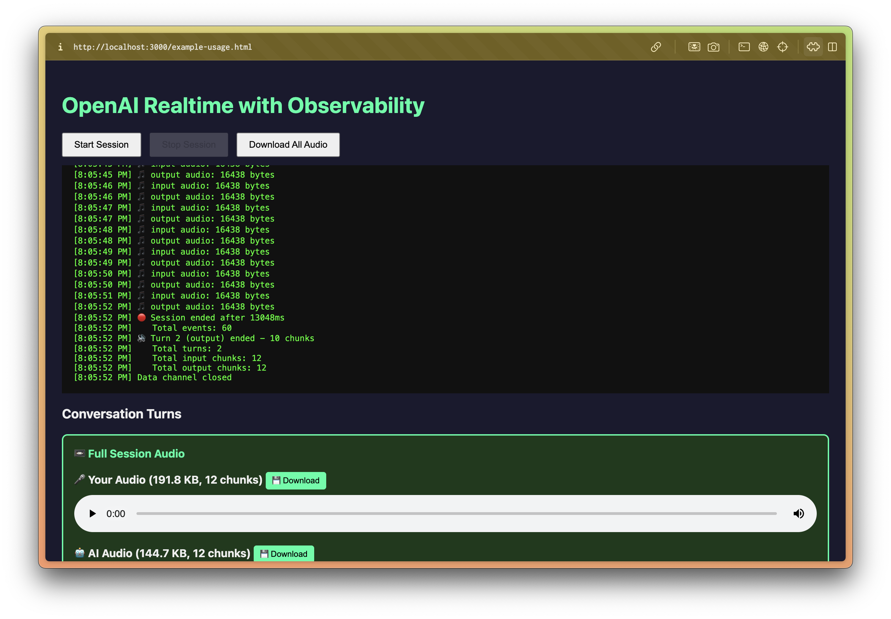

# OpenAI Realtime API Observability

A drop-in observability package for capturing data from OpenAI's Realtime API WebRTC sessions.

## The Challenge

OpenAI's Realtime API uses WebRTC for real-time voice conversations. The architecture looks like this:

```
┌─────────────────────────────────────────────────────────────┐
│                         BROWSER                              │
│                                                              │
│   1. Create RTCPeerConnection                                │
│   2. Get microphone access                                   │
│   3. Create SDP offer                                        │
│   4. POST offer to server → server forwards to OpenAI        │
│   5. Receive SDP answer                                      │
│   6. WebRTC connection established                           │
│                                                              │
└──────────────────────────┬──────────────────────────────────┘
                           │
                           │ WebRTC (direct peer-to-peer)
                           │ • Audio via RTP
                           │ • Events via DataChannel
                           ▼
              ┌─────────────────────────┐
              │   OpenAI Realtime API   │
              └─────────────────────────┘
```

**The problem**: The server only facilitates the initial SDP exchange. After that, all audio and data channel messages flow **directly** between the browser and OpenAI, bypassing your server entirely.

## Solution

We created `openai-realtime-observability.js` - a client-side package that intercepts:

| Data Type | How It's Captured |
|-----------|-------------------|
| **SDP Signaling** | Wraps `fetch()` to capture offer/answer |
| **Data Channel Events** | Wraps `RTCPeerConnection` to intercept `createDataChannel()` and message handlers |
| **Input Audio** | Uses `MediaRecorder` on the microphone stream |
| **Output Audio** | Uses `MediaRecorder` on the received audio track |
| **Transcripts** | Extracted from `response.output_audio_transcript.delta` events |



## Usage

```javascript
import { createRealtimeObserver } from './openai-realtime-observability.js';

// 1. Create observer with callbacks
const observer = createRealtimeObserver({
    onEvent: (event) => {
        console.log(`${event.direction}: ${event.type}`);
        // e.g. "incoming: response.output_audio_transcript.delta"
    },
    onAudio: (audio) => {
        console.log(`${audio.direction} audio: ${audio.size} bytes`);
        // audio.blob contains the raw Blob for local playback
        // audio.data contains base64 for remote transmission
    },
    onSessionStart: (session) => console.log('Session:', session.id),
    onSessionEnd: (session) => {
        console.log('Duration:', session.duration);
        console.log('Transcript:', session.transcript.output);
    },
    onSignaling: (sig) => console.log(`SDP ${sig.type}`),
});

// 2. Wrap RTCPeerConnection
const pc = observer.wrapPeerConnection(new RTCPeerConnection());

// 3. Use observer.fetch for the SDP exchange
const response = await observer.fetch('/session', {
    method: 'POST',
    body: offer.sdp,
    headers: { 'Content-Type': 'application/sdp' },
});

// 4. Record microphone audio
const mic = await navigator.mediaDevices.getUserMedia({ audio: true });
observer.startInputAudioRecording(mic);
```

## Events Captured

The data channel carries all these events from OpenAI:

```
session.created
session.updated
input_audio_buffer.speech_started
input_audio_buffer.speech_stopped
input_audio_buffer.committed
conversation.item.added
conversation.item.done
response.created
response.output_item.added
response.content_part.added
response.output_audio_transcript.delta  (contains transcript text)
output_audio_buffer.started
response.output_audio.done
response.output_audio_transcript.done
response.content_part.done
response.output_item.done
response.done
rate_limits.updated
output_audio_buffer.stopped
```

## Audio Recording Gotchas

### WebM Header Requirement

MediaRecorder produces WebM chunks where:
- **Chunk 0**: Contains EBML header + segment info (required for playback)
- **Chunks 1+**: Just cluster data (continuation)

If you want to save audio per-turn (not full session), you **must include chunk 0** in every file, otherwise the WebM won't be playable.

```javascript
// Wrong - missing header, won't play
const turnBlob = new Blob(chunks.slice(turnStartIndex), { type: 'audio/webm' });

// Correct - prepend chunk 0 for header
const turnBlob = new Blob([chunks[0], ...chunks.slice(turnStartIndex)], { type: 'audio/webm' });
```

### Turn Boundary Timing

Audio chunks from MediaRecorder don't align perfectly with data channel events. Audio often arrives **before** the corresponding event:

```
🎵 output audio: 386 bytes      ← Audio arrives first
📨 output_audio_buffer.started   ← Event arrives after
```

Solution: Track the chunk index when a turn starts, then at turn end, slice all chunks from that index.

## Files

- `public/openai-realtime-observability.js` - The observability package
- `public/example-usage.html` - Full working example with turn-based audio recording
- `public/index.html` - Original Realtime API demo (without observability)
- `test.js` - Express server that proxies SDP to OpenAI

## Running

```bash
npm install
npm start
# Open http://localhost:3000/example-usage.html
```

## Alternative: Webhook Observer

Send all data to your backend:

```javascript
import { createWebhookObserver } from './openai-realtime-observability.js';

const observer = createWebhookObserver('https://your-api.com/observability', {
    sendAudioToWebhook: false, // Skip large audio data
});
```

## What We Learned

1. **WebRTC is peer-to-peer** - Your server only sees the SDP exchange, not the actual media/data
2. **Must intercept on the client** - Wrap `RTCPeerConnection` and `fetch` before the connection is established
3. **MediaRecorder chunk structure matters** - First chunk has headers, must be included for playback
4. **Event timing is asynchronous** - Audio chunks and data channel events don't arrive in sync
5. **Use `addEventListener` not `onX`** - Properties like `pc.ontrack` can be overwritten, but `addEventListener` persists

